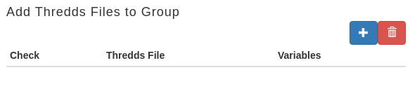

.. |add| image:: images/add.png

.. |trash| image:: images/trash.png

=========================
MDE Admin Functionalities
=========================

The MDE admin functionalities are only available for the MDE administrators.

Adding and Deleting Data Catalogs and TDS Files
***********************************************

To add Catalogs, administrators should use the |add| icon to access the “Add a Catalog of TDS files” menu.

.. image:: images/1.14.png
   :width: 1000
   :align: center

In this menu, to add a new Catalog of TDS files, administrators should enter its title, description, and press the |add| icon to add TDS files if available.

.. note::
   .. image:: images/add_tds.png
      :align: center
      :scale: 75

   To add multiple TDS files the |add| icon can be used. If the user needs to remove a TDS file, the user can use the |trash| icon.

Pressing the |add| icon will open the "Add a TDS File" Menu, administrators should enter a title, description, a TDS Endpoint/URL.
Once the TDS URL is provided, press the |go_tds| button to load the content of the TDS. Navigate through the folders until you find the
desired TDS file. Next select the TDS file, and the variables in the TDS file will load in a table. Select the variables that you want
to add with the TDS file.

This process can be repeated for every TDS file that wants to be added to the Catalog at the time of the Catalog's creation.

.. note::

   The added TDS should be in the EPSG 4326 coordinate reference system to be compatible with the WDE application. Otherwise, the WDE will add
   the TDS, but it will not be able to retrieve the values from the TDS.

.. note::

   When entering the TDS URL, it needs to finish in .catalog.hml or .catalog.xml. For example,
   `https://thredds.ucar.edu/thredds/catalog/grib/NCEP/GFS/Global_0p25deg/catalog.html <https://thredds.ucar.edu/thredds/catalog/grib/NCEP/GFS/Global_0p25deg/catalog.html>`_

.. image:: images/1.15.png
   :width: 1000
   :align: center

.. image:: images/1.15b.png
   :width: 1000
   :align: center

.. image:: images/1.16.png
   :width: 1000
   :align: center

.. image:: images/1.17.png
   :width: 1000
   :align: center

To add TDS files to a specific Catalog, administrators should use the |add| icon to the right of  the Catalog’s title to access the “Add a TDS File” menu.

.. note::

   Notice that this menu is the same one that allows to add TDS files at the moment of a Catalog's creation,
   as a result the same steps can be used.

To delete Catalogs, administrators should use the trash icon to access the “Delete Catalogs” menu and select the Catalog to be deleted.

.. image:: images/1.18.png
   :width: 1000
   :align: center

To delete TDS files, administrators should use the |trash| icon to access the “Delete TDS Files” menu and select the TDS files to be deleted.

.. image:: images/1.19.png
   :width: 1000
   :align: center
